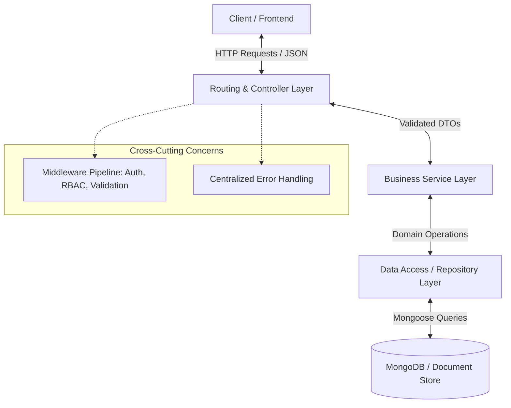
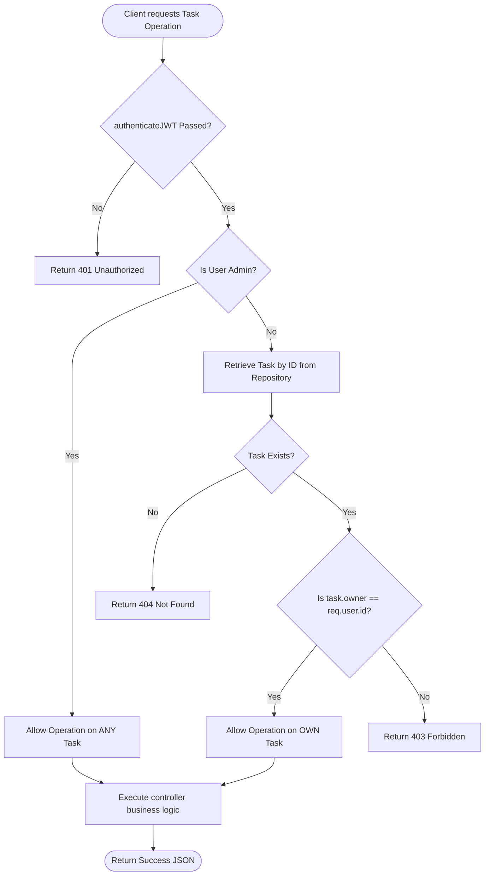
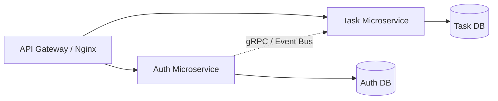

# AuthFlow: Production-Ready Architectural Blueprint

This document outlines the end-to-end software architecture, database design, middleware pipeline, and frontend/backend modular structures for the **AuthFlow** internship assignment. It is designed to impress backend interviewers by demonstrating a clear understanding of enterprise design patterns, security best practices, and scalability considerations, while remaining highly pragmatic for a 3-day implementation lifecycle.

---

## 1. Architectural Philosophy & Major Tradeoffs

Enterprise systems prioritize separation of concerns, strict contract compliance, testability, and defensive security. In AuthFlow, we reject the typical beginner "fat controller" pattern in favor of the **Controller-Service-Repository (CSR)** pattern adapted for Node.js and Express.

### CSR Architecture Overview


### Key Tradeoff Analysis

| Decision Area | Proposed Approach | Alternatives Considered | Tradeoff & Justification |
| :--- | :--- | :--- | :--- |
| **Business Logic Isolation** | **Controller-Service-Repository (CSR)** | Fat Controllers (Mongoose in routes) | **Pros**: Services are database-agnostic; controllers only handle HTTP details (status codes, headers). Business logic is highly unit-testable. <br>**Cons**: Minor boilerplate overhead, but crucial for demonstrating engineering maturity. |
| **JWT Storage** | **Secure, HttpOnly, SameSite Cookies** | `localStorage` / `sessionStorage` | **Pros**: Immune to Cross-Site Scripting (XSS) token extraction. <br>**Cons**: Slightly more complex CORS configuration and CSRF protection required. However, for a security-focused application, this is the gold standard that interviewers look for. |
| **Request Validation** | **Zod Schema Validation Middleware** | Custom `if-else` or `express-validator` | **Pros**: Declarative, highly readable, supports easy type inference, and runs *before* controller logic, ensuring only clean data passes downstream. |
| **Error Handling** | **Centralized Operational Error Classes** | Inline `try/catch` in every route | **Pros**: Eliminates redundant try/catch blocks via an async wrapper. Formats standard error payloads and hides internal database stack traces in production. |

---

## A. Complete Folder Structure

Below is a highly modular, professional, and clean folder structure designed for scalability. It separates the project into backend (`server`) and frontend (`client`) directories.

```text
authflow/
├── docker-compose.yml           # Local multi-container orchestrator
├── client/                      # React + Vite Frontend
│   ├── public/
│   ├── src/
│   │   ├── assets/              # Icons, global styling tokens, images
│   │   ├── components/          # Reusable presentation-only UI components
│   │   │   ├── ui/              # Buttons, inputs, modals, cards (base components)
│   │   │   ├── Layout.jsx       # Global application shell (header, sidebar, container)
│   │   │   └── ProtectedRoute.jsx # Guarded route wrapper for RBAC & Auth
│   │   ├── context/             # Global react states
│   │   │   ├── AuthContext.jsx  # Global session management, login, logout
│   │   │   └── TaskContext.jsx  # Task operations and tracking
│   │   ├── hooks/               # Custom reusable React hooks
│   │   │   ├── useAuth.js
│   │   │   └── useHttp.js       # Abstracted custom fetch/axios calls with interceptors
│   │   ├── pages/               # Page components representing views
│   │   │   ├── Login.jsx
│   │   │   ├── Register.jsx
│   │   │   ├── Dashboard.jsx
│   │   │   ├── TaskForm.jsx     # Handles both creation & editing
│   │   │   └── TaskList.jsx
│   │   ├── services/            # API call abstractions (no UI state)
│   │   │   ├── authService.js
│   │   │   └── taskService.js
│   │   ├── App.jsx              # Main routing configuration
│   │   ├── index.css            # Base Tailwind or custom vanilla styling
│   │   └── main.jsx             # React DOM entrypoint
│   │   
│   ├── package.json
│   └── vite.config.js
│
└── server/                      # Node.js + Express Backend
    ├── config/                  # Database, Redis, and environment configs
    │   ├── db.js
    │   └── environment.js
    ├── src/
    │   ├── constants/           # HTTP status codes, error codes, role constants
    │   │   └── roles.js
    │   ├── controllers/         # Handles HTTP requests and responses
    │   │   ├── auth.controller.js
    │   │   ├── task.controller.js
    │   │   └── user.controller.js
    │   ├── errors/              # Custom app exception classes
    │   │   ├── AppError.js      # Base custom error class
    │   │   └── types.js         # BadRequestError, UnauthorizedError, etc.
    │   ├── middleware/          # Express route middlewares
    │   │   ├── auth.middleware.js # JWT verification
    │   │   ├── error.middleware.js # Centralized exception handler
    │   │   ├── rateLimiter.js   # API request speed gating
    │   │   ├── rbac.middleware.js # Role checks & scope assertion
    │   │   └── validate.js      # Zod validation validator
    │   ├── models/              # Mongoose data schemas
    │   │   ├── task.model.js
    │   │   └── user.model.js
    │   ├── repositories/        # Direct database interaction layers
    │   │   ├── task.repository.js
    │   │   └── user.repository.js
    │   ├── routes/              # Express endpoint routes
    │   │   ├── index.js         # Master API router (v1 mount)
    │   │   ├── auth.routes.js
    │   │   ├── task.routes.js
    │   │   └── user.routes.js
    │   ├── services/            # Encapsulates business logic
    │   │   ├── auth.service.js
    │   │   ├── task.service.js
    │   │   └── user.service.js
    │   ├── utils/               # Helpers, token generators, hashers
    │   │   ├── catchAsync.js    # Express async/await handler wrapper
    │   │   └── token.js
    │   ├── app.js               # Express application initialization
    │   └── server.js            # Entry point running the HTTP server
    │
    ├── docs/                    # OpenAPI specifications / Swagger setups
    │   └── swagger.json
    ├── .env.example
    ├── package.json
    └── Dockerfile
```

---

## B. MongoDB Schema Design

Mongoose structures must ensure data integrity, performant lookup operations, and strict validation. We implement indexing, password hashing hooks, and JSON sanitization rules directly in our Mongoose layers.

### 1. User Schema Design (`server/src/models/user.model.js`)

```javascript
const mongoose = require('mongoose');
const bcrypt = require('bcryptjs');
const { ROLES, ALL_ROLES } = require('../constants/roles');

const userSchema = new mongoose.Schema(
  {
    name: {
      type: String,
      required: [true, 'Name is required'],
      trim: true,
      maxlength: [50, 'Name cannot exceed 50 characters'],
    },
    email: {
      type: String,
      required: [true, 'Email is required'],
      unique: true,
      trim: true,
      lowercase: true,
      match: [
        /^\w+([\.-]?\w+)*@\w+([\.-]?\w+)*(\.\w{2,3})+$/,
        'Please fill a valid email address',
      ],
    },
    password: {
      type: String,
      required: [true, 'Password is required'],
      minlength: [8, 'Password must be at least 8 characters long'],
      select: false, // Do not return password by default in queries
    },
    role: {
      type: String,
      enum: ALL_ROLES,
      default: ROLES.USER,
    },
  },
  {
    timestamps: true,
    toJSON: {
      virtuals: true,
      transform: (doc, ret) => {
        delete ret.password;
        delete ret.__v;
        return ret;
      },
    },
  }
);

// Indexes for ultra-fast auth queries
userSchema.index({ email: 1 });

// Password hashing pre-save hook
userSchema.pre('save', async function (next) {
  if (!this.isModified('password')) return next();
  try {
    const salt = await bcrypt.genSalt(12); // Production standard cost factor
    this.password = await bcrypt.hash(this.password, salt);
    next();
  } catch (err) {
    next(err);
  }
});

// Instance method for password verification
userSchema.methods.comparePassword = async function (candidatePassword) {
  return await bcrypt.compare(candidatePassword, this.password);
};

module.exports = mongoose.model('User', userSchema);
```

### 2. Task Schema Design (`server/src/models/task.model.js`)

```javascript
const mongoose = require('mongoose');

const taskSchema = new mongoose.Schema(
  {
    title: {
      type: String,
      required: [true, 'Task title is required'],
      trim: true,
      maxlength: [100, 'Title cannot exceed 100 characters'],
    },
    description: {
      type: String,
      trim: true,
      maxlength: [500, 'Description cannot exceed 500 characters'],
    },
    status: {
      type: String,
      enum: ['TODO', 'IN_PROGRESS', 'DONE'],
      default: 'TODO',
    },
    owner: {
      type: mongoose.Schema.Types.ObjectId,
      ref: 'User',
      required: [true, 'Task must belong to an owner'],
    },
  },
  {
    timestamps: true,
    toJSON: {
      virtuals: true,
      transform: (doc, ret) => {
        delete ret.__v;
        return ret;
      },
    },
  }
);

// Compound index for fast retrieval of owner-scoped tasks filtered by status
taskSchema.index({ owner: 1, status: 1 });
taskSchema.index({ title: 'text' }); // Allows fast free-text search on dashboard

module.exports = mongoose.model('Task', taskSchema);
```

---

## C. API Endpoint Design

We design routes inside a RESTful namespace under `/api/v1` and ensure a reliable API signature.

### Success Response Contract
```json
{
  "status": "success",
  "results": 1,
  "data": {
    "task": {
      "id": "60d0fe4f5311236168a109ca",
      "title": "Setup Architecture",
      "status": "TODO"
    }
  }
}
```

### Error Response Contract
```json
{
  "status": "error",
  "message": "Task not found with ID 60d0fe4f5311236168a109ca",
  "code": "RESOURCE_NOT_FOUND",
  "stack": "Error: Task not found... (only visible in DEVELOPMENT)"
}
```

### API Endpoint Registry

| Route Endpoint | HTTP Verb | Middleware Guards | Purpose / Action |
| :--- | :--- | :--- | :--- |
| **`/api/v1/auth/register`** | `POST` | `rateLimiter`, `validateRegister` | Creates user account. Returns JWT Cookie. |
| **`/api/v1/auth/login`** | `POST` | `rateLimiter`, `validateLogin` | Validates credentials. Returns JWT Cookie. |
| **`/api/v1/auth/logout`** | `POST` | `authenticateJWT` | Invalidates access cookie immediately. |
| **`/api/v1/auth/me`** | `GET` | `authenticateJWT` | Retrieves current session user info. |
| **`/api/v1/tasks`** | `GET` | `authenticateJWT` | Fetches tasks (Admin gets ALL; User gets OWN). Supports pagination `?page=1&limit=10`. |
| **`/api/v1/tasks`** | `POST` | `authenticateJWT`, `validateTask` | Creates task, setting `owner` to logged-in user. |
| **`/api/v1/tasks/:id`** | `GET` | `authenticateJWT` | Retrieves specific task. Checked via RBAC (Owner/Admin only). |
| **`/api/v1/tasks/:id`** | `PUT` | `authenticateJWT`, `validateTaskUpdate` | Updates specific task status or description. |
| **`/api/v1/tasks/:id`** | `DELETE` | `authenticateJWT` | Deletes task. Checked via RBAC. |
| **`/api/v1/users`** | `GET` | `authenticateJWT`, `authorize(ADMIN)` | List all system users. |
| **`/api/v1/users/:id`** | `DELETE` | `authenticateJWT`, `authorize(ADMIN)` | Hard-delete a user account. |

---

## D. Middleware Architecture

Express middleware pipelines function as request filters. Using standard decorators and validators makes routes modular and bulletproof.

```text
HTTP Request
     │
     ▼
┌─────────────────────────────────┐
│     Global Security Guards      │  (CORS, Helmet, RateLimiter)
└─────────────────────────────────┘
     │
     ▼
┌─────────────────────────────────┐
│   Zod / Validation Middleware   │  (Runs schema validation on body/params/query)
└─────────────────────────────────┘
     │
     ▼
┌─────────────────────────────────┐
│       Authentication Guard      │  (authenticateJWT - Decodes Token to req.user)
└─────────────────────────────────┘
     │
     ▼
┌─────────────────────────────────┐
│    RBAC / Scope Authorization   │  (authorizeRoles - Asserts role constraints)
└─────────────────────────────────┘
     │
     ▼
┌─────────────────────────────────┐
│        Controller Action        │  (Calls domain services under catchAsync wrapper)
└─────────────────────────────────┘
     │
     ▼
┌─────────────────────────────────┐
│ Centralized Exception Middleware │  (Formats response payload uniformly)
└─────────────────────────────────┘
```

### 1. Unified Validation Middleware (`server/src/middleware/validate.js`)
We use a high-order function wrapping schema parsing. This ensures validation errors are uniformly intercepted before executing controllers.

```javascript
const AppError = require('../errors/AppError');

const validate = (schema) => (req, res, next) => {
  try {
    schema.parse({
      body: req.body,
      query: req.query,
      params: req.params,
    });
    next();
  } catch (error) {
    const errorDetails = error.errors.map(err => ({
      field: err.path.join('.'),
      message: err.message
    }));
    
    // Throw standard operational error with structured details
    next(new AppError('Validation failed', 400, 'VALIDATION_ERROR', errorDetails));
  }
};
```

### 2. Guard Authentication Middleware (`server/src/middleware/auth.middleware.js`)
Verifies JWT signature and extracts user references.

```javascript
const jwt = require('jsonwebtoken');
const AppError = require('../errors/AppError');
const catchAsync = require('../utils/catchAsync');
const userRepository = require('../repositories/user.repository');

exports.authenticateJWT = catchAsync(async (req, res, next) => {
  let token;
  
  // Extract from secure cookies or Authorization header
  if (req.cookies && req.cookies.token) {
    token = req.cookies.token;
  } else if (req.headers.authorization && req.headers.authorization.startsWith('Bearer')) {
    token = req.headers.authorization.split(' ')[1];
  }

  if (!token) {
    return next(new AppError('Authentication required. Please log in.', 401, 'UNAUTHORIZED'));
  }

  // Verify signature
  const decoded = jwt.verify(token, process.env.JWT_SECRET);
  
  // Fetch active user from Repository layer
  const currentUser = await userRepository.findById(decoded.id);
  if (!currentUser) {
    return next(new AppError('The user belonging to this token no longer exists.', 401, 'UNAUTHORIZED'));
  }

  req.user = currentUser; // Inject active session context
  next();
});
```

### 3. Role-Based Access Middleware (`server/src/middleware/rbac.middleware.js`)
Role assertion checks permissions using flexible declarative arguments.

```javascript
const AppError = require('../errors/AppError');

exports.authorizeRoles = (...allowedRoles) => {
  return (req, res, next) => {
    if (!req.user) {
      return next(new AppError('User session context not established', 500, 'INTERNAL_SERVER_ERROR'));
    }

    if (!allowedRoles.includes(req.user.role)) {
      return next(new AppError('You do not have permission to perform this action', 403, 'FORBIDDEN'));
    }

    next();
  };
};
```

---

## E. Authentication Flow Diagram

This flow uses secure **HttpOnly Cookies** which protect JWT tokens from malicious JS scripts (preventing XSS theft).

```mermaid
sequenceDiagram
    autonumber
    actor Client as Client Browser
    participant API as Express API Gate
    participant AuthServ as AuthService
    participant DB as MongoDB

    %% Registration Flow
    Note over Client, DB: User Registration (Signup)
    Client->>API: POST /api/v1/auth/register (name, email, password)
    API->>API: Run Zod Schema Validation
    API->>AuthServ: Create user instance
    AuthServ->>DB: Check email duplicate & Save (Mongoose hashes password)
    DB-->>AuthServ: User Created
    AuthServ->>API: Generate signed JWT
    API-->>Client: HTTP 201 Created + Cookie [token=jwt; HttpOnly; Secure; SameSite=Strict]

    %% Login Flow
    Note over Client, DB: User Login
    Client->>API: POST /api/v1/auth/login (email, password)
    API->>AuthServ: Verify credentials
    AuthServ->>DB: Fetch password (select: +password)
    DB-->>AuthServ: Returns record
    AuthServ->>AuthServ: comparePassword() via bcrypt
    AuthServ->>API: Validated Session
    API-->>Client: HTTP 200 OK + Cookie [token=jwt; HttpOnly; Secure; SameSite=Strict]
```

---

## F. Role-Based Access Control (RBAC) Flow

This diagram outlines how permissions are asserted when executing operations on Task instances (e.g. `GET /tasks/:id` or `DELETE /tasks/:id`).



---

## G. Frontend Architecture (React + Vite)

The frontend is structured to match the backend's modular rigor. It uses custom routing guards, centralized state managers (Context API), and an Axios HTTP client containing automatic interceptors.

### 1. HTTP Network Client (`client/src/hooks/useHttp.js`)
Ensures all API outgoing calls pass the correct cookie configurations and intercepts `401 Unauthorized` responses to clear active page sessions cleanly.

```javascript
import axios from 'axios';
import { useNavigate } from 'react-router-dom';

const API_URL = import.meta.env.VITE_API_URL || 'http://localhost:5000/api/v1';

export const useHttp = () => {
  const navigate = useNavigate();

  const client = axios.create({
    baseURL: API_URL,
    withCredentials: true, // Crucial! Sends cookies automatically on all requests
    headers: {
      'Content-Type': 'application/json',
    },
  });

  // Response Interceptor for global error intercepting
  client.interceptors.response.use(
    (response) => response,
    (error) => {
      if (error.response && error.response.status === 401) {
        // Auth session expired, boot back to login screen
        localStorage.removeItem('isAuthenticated'); 
        navigate('/login');
      }
      return Promise.reject(error.response?.data || { message: 'Network connection issue' });
    }
  );

  return client;
};
```

### 2. Session Context Provider (`client/src/context/AuthContext.jsx`)

```javascript
import React, { createContext, useState, useEffect } from 'react';
import { useHttp } from '../hooks/useHttp';

export const AuthContext = createContext(null);

export const AuthProvider = ({ children }) => {
  const [user, setUser] = useState(null);
  const [loading, setLoading] = useState(true);
  const http = useHttp();

  useEffect(() => {
    const bootstrapSession = async () => {
      try {
        const response = await http.get('/auth/me');
        setUser(response.data.data.user);
      } catch (err) {
        setUser(null);
      } finally {
        setLoading(false);
      }
    };
    bootstrapSession();
  }, []);

  const login = async (email, password) => {
    const response = await http.post('/auth/login', { email, password });
    setUser(response.data.data.user);
  };

  const register = async (name, email, password) => {
    const response = await http.post('/auth/register', { name, email, password });
    setUser(response.data.data.user);
  };

  const logout = async () => {
    await http.post('/auth/logout');
    setUser(null);
  };

  return (
    <AuthContext.Provider value={{ user, loading, login, register, logout, isAuthenticated: !!user }}>
      {children}
    </AuthContext.Provider>
  );
};
```

### 3. Declarative Route Guard Component (`client/src/components/ProtectedRoute.jsx`)

```javascript
import React, { useContext } from 'react';
import { Navigate, Outlet } from 'react-router-dom';
import { AuthContext } from '../context/AuthContext';

export const ProtectedRoute = ({ allowedRoles }) => {
  const { user, loading, isAuthenticated } = useContext(AuthContext);

  if (loading) {
    return <div className="spinner-loading">Bootstrapping session...</div>;
  }

  if (!isAuthenticated) {
    return <Navigate to="/login" replace />;
  }

  if (allowedRoles && !allowedRoles.includes(user.role)) {
    return <Navigate to="/dashboard" replace />;
  }

  return <Outlet />; // Renders nested child routing pages
};
```

---

## H. Swagger / OpenAPI Integration Plan

Instead of relying on disconnected documentation, we define OpenAPI schemas **inline using Swagger-JSDoc comment decorators** directly inside Express route controllers. This keeps endpoints and documentation co-located.

### Swagger Controller Comment Standard Example
```javascript
/**
 * @swagger
 * /tasks:
 *   post:
 *     summary: Create a new task
 *     tags: [Tasks]
 *     security:
 *       - cookieAuth: []
 *     requestBody:
 *       required: true
 *       content:
 *         application/json:
 *           schema:
 *             $ref: '#/components/schemas/TaskInput'
 *     responses:
 *       201:
 *         description: Task successfully created
 *         content:
 *           application/json:
 *             schema:
 *               $ref: '#/components/schemas/TaskSuccessResponse'
 *       400:
 *         description: Validation failed
 *       401:
 *         description: Unauthorized
 */
```

### Setup Sequence:
1. **Packages**: Install `swagger-jsdoc` and `swagger-ui-express`.
2. **Mounting**: Instantiated in `server/src/app.js` under the `/api-docs` route wrapper, visible in development mode.
3. **OpenAPI Definition**: Include global cookie authentication requirements, schemas for entities (User, Task), and unified error response objects.

---

## I. Production-Ready README Structure

A pristine README should look highly professional and contain all necessary information for quick onboarding.

```markdown
# AuthFlow (Advanced RBAC System)

A premium, production-style REST API and Single Page Application (SPA) designed to showcase secure Authentication, strict Role-Based Access Control, standard operational middleware patterns, and high-performance task scheduling.

## Technical Core Architecture
- **Backend:** Node.js, Express, MongoDB, Mongoose, JWT (HttpOnly Cookies), Zod, Swagger JSDoc.
- **Frontend:** React, Vite, Axios Client (Interceptors), Context Hooks, Vanilla-Modern Responsive Styling.

---

## Getting Started

### Prerequisites
- Node.js (v18+ recommended)
- MongoDB running locally or a MongoDB Atlas URI string
- Docker Desktop (Optional, for running with container stack)

### Env Configuration Setup
Create a `.env` file under the `/server` directory using the provided `.env.example`:
```env
PORT=5000
MONGO_URI=mongodb://localhost:27017/authflow
JWT_SECRET=super_secure_enterprise_grade_secret_key_102938
NODE_ENV=development
```

### Installation
```bash
# Clone the repository
git clone https://github.com/username/authflow.git
cd authflow

# Build and start the backend
cd server
npm install
npm run dev

# Build and start the frontend
cd ../client
npm install
npm run dev
```

### Docker Compose Quick-Start
```bash
docker-compose up --build
```

---

## API Documentation
Once running, you can explore the complete Swagger/OpenAPI interactive interface:
- **Swagger Docs:** `http://localhost:5000/api-docs`
- **Postman Spec:** Imprinted JSON collections are found in `./docs/postman_collection.json`.
```

---

## J. Scalability Note

### 1. Future Redis Integration (Caching & Speed Gating)
- **Rate-Limiting**: Move from raw in-memory storage (which breaks across multiple instances behind a load balancer) to a centralized Redis-based store (`rate-limit-redis`).
- **Token Blacklisting**: If users log out, write the JWT hash to Redis with an expiration identical to the token's TTL. The `authenticateJWT` middleware will check Redis first; blacklisted tokens will be rejected immediately, allowing instantaneous server-side session revocation.
- **Task Cache**: Cache task lists (`GET /api/v1/tasks`). Invalidate cache key `user:${id}:tasks` on any task creation, edit, or deletion operations.

### 2. Future Microservices Migration Plan
The clean separation of our CSR architecture enables an easy migration path to microservices:



- **Step 1: Auth Separation**: Extract `routes/auth.routes.js`, `controllers/auth.controller.js`, `services/auth.service.js`, and `models/user.model.js` into an `Auth Microservice`.
- **Step 2: Task Separation**: Set up `Task Microservice` with `models/task.model.js` holding only a string `ownerId`.
- **Step 3: Signature Asserting**: The Gateway handles authentication checks and maps decoded token claims into standard HTTP Headers (`X-User-Id`, `X-User-Role`) before proxying requests to the downstream Task Microservice. This keeps the Task Service decoupled from the User database.

### 3. Docker Container Strategy
- **Development**: Bind-mount local backend and frontend folders into separate NodeJS dev containers to allow Hot Reloading.
- **Production Multi-Stage Dockerfile**:
```dockerfile
# Stage 1: Build Frontend Assets
FROM node:18-alpine AS frontend-builder
WORKDIR /app/client
COPY client/package*.json ./
RUN npm ci
COPY client/ ./
RUN npm run build

# Stage 2: Express Server & Static Asset Serve
FROM node:18-alpine
WORKDIR /app/server
ENV NODE_ENV=production
COPY server/package*.json ./
RUN npm ci --only=production
COPY server/ ./
COPY --from=frontend-builder /app/client/dist ./public
EXPOSE 5000
CMD ["node", "src/server.js"]
```

---

## K. Step-by-Step Implementation Roadmap

Below is the developer roadmap designed to complete the assignment systematically, ensuring all components have tests before moving forward.

```text
 PHASE 1: FOUNDATIONS (Day 1 - Morning)
   ├── Create workspace structure (server/ and client/ paths)
   ├── Setup Docker Compose + Node.js servers
   └── Connect MongoDB database, build Custom Operational Error classes

 PHASE 2: AUTH & SECURITY (Day 1 - Afternoon / Night)
   ├── Build Mongoose User Model with bcrypt hook
   ├── Code Repository, Service, and Controller layers for Authentication
   └── Secure routes with rate-limiters, helmet, and authenticateJWT middleware

 PHASE 3: DOMAIN ENTITIES & RBAC (Day 2 - Morning / Afternoon)
   ├── Build Mongoose Task Model with compound performance indexing
   ├── Create Task Repository and Service with strict owner ownership assertions
   ├── Bind authorizeRoles() middleware to CRUD controllers
   └── Ensure Swagger annotations are mounted correctly

 PHASE 4: FRONTEND CORE (Day 2 - Night)
   ├── Scaffold Vite app + modern vanilla styles index
   ├── Configure Axios Http Client with custom token interceptors
   └── Build AuthProvider Context & Protected Route guards

 PHASE 5: FRONTEND VIEWS (Day 3 - Morning / Afternoon)
   ├── Code Login and Registration views
   ├── Design Dashboard with dynamic status visualizers
   └── Build Task Create and Edit Modals/Forms

 PHASE 6: POLISHING & SUBMISSION (Day 3 - Evening)
   ├── Perform full end-to-end user testing (Admin CRUD vs User CRUD)
   ├── Document README, package Postman JSON specs
   └── Finalize Docker builds and package deliverables
```

---

## L. Optimized 3-Day Development Order

To maximize speed and minimize integration bugs, we build the backend completely first and use it as the source of truth for the client.

### Day 1: Backend Security Core (Authentication, Middlewares, Models)
- **Focus**: Setting up a bulletproof backend environment.
- **Goal**: Secure login/register endpoints working flawlessly, returning JWT inside secure cookies.
- **Testing**: Validate register and login endpoints via Curl, Postman, or local automated integration tests.

### Day 2: Business Logic & Docs (Tasks Entity, RBAC, Swagger Docs)
- **Focus**: Task CRUD logic and permission rules.
- **Goal**: Secure Task endpoints where Users can only access their own tasks, and Admins have unrestricted system access.
- **Documentation**: Write inline JSDoc comments to generate the interactive Swagger user interface instantly. 

### Day 3: Frontend Integration & Visual UI Polishing
- **Focus**: Beautiful responsive React interface and system verification.
- **Goal**: Dynamic user dashboards, seamless login flows with visual alerts on task CRUD actions.
- **Polish**: Final check of production containers, error boundary handling, and README markdown structuring.
